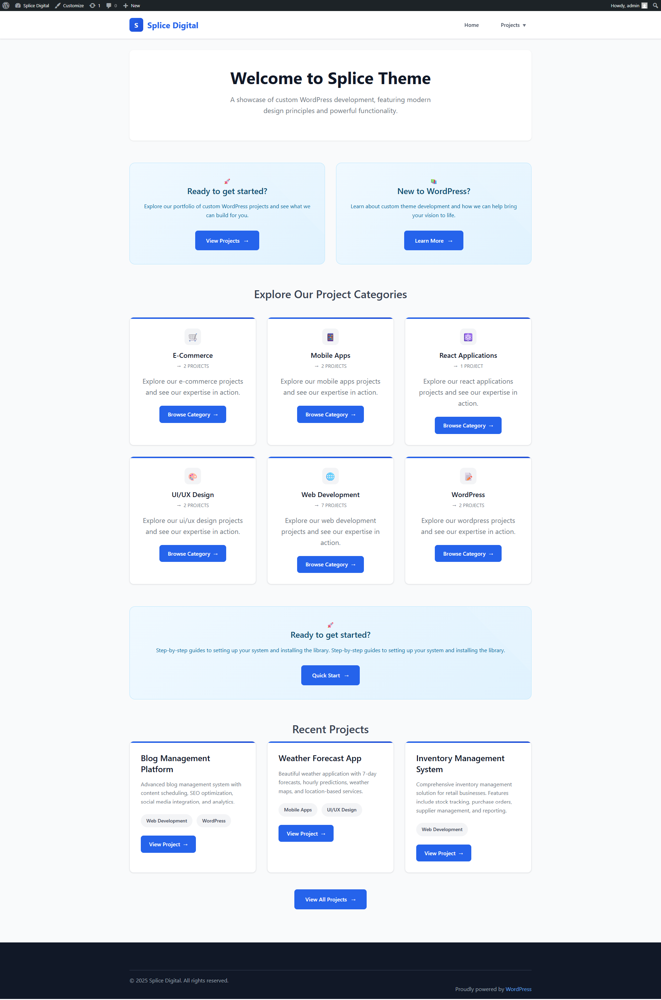

# Splice Digital - WordPress Custom Theme

A comprehensive, custom-built WordPress theme showcasing advanced front-end and back-end development skills. This theme demonstrates modern web development practices, custom post types, REST APIs, security implementations, and responsive design.



## 🚀 Features

### Core Functionality

- **Custom Post Types**: Projects with custom fields and taxonomies
- **Dynamic Navigation**: Multi-level dropdown menus with smooth animations
- **Responsive Design**: Mobile-first approach with modern CSS Grid and Flexbox
- **Security Implementation**: Comprehensive security best practices
- **Custom REST APIs**: Full CRUD operations for projects
- **Advanced Filtering**: Date range, search, and taxonomy filtering
- **Performance Optimized**: Clean, efficient code with minimal dependencies

### Design Features

- **Modern UI/UX**: Clean, professional design with smooth animations
- **Fade-in Effects**: Intersection Observer-based animations
- **Gradient Backgrounds**: Beautiful color schemes and visual effects
- **Interactive Elements**: Hover effects, transitions, and micro-interactions
- **Typography**: Optimized font hierarchy and readability

### Technical Features

- **WordPress Standards**: Follows WordPress coding standards and best practices
- **Security Headers**: XSS protection, clickjacking prevention, and more
- **Input Sanitization**: Comprehensive data validation and sanitization
- **Rate Limiting**: API protection against abuse
- **Error Logging**: Security event tracking and monitoring

## 📋 Requirements

- **WordPress**: 5.0 or higher
- **PHP**: 7.4 or higher
- **MySQL**: 5.6 or higher
- **Web Server**: Apache or Nginx
- **Browser Support**: Modern browsers (Chrome, Firefox, Safari, Edge)

## 🛠️ Installation

### Option 1: Complete Project Setup (Recommended for Demo/Portfolio)

This option gives you the complete working site with all content, projects, and configurations.

#### Prerequisites

- Local development environment (XAMPP, MAMP, Local by Flywheel, etc.)
- PHP 7.4+ and MySQL 5.6+

#### Steps:

1. **Clone the entire repository**:

   ```bash
   git clone https://github.com/ryan7998/Splice_Wordpress.git
   cd Splice_Wordpress
   ```

2. **Set up your local environment**:

   - Create a new database
   - Configure your local domain (e.g., `splice-wordpress.local`)

3. **Import the database**:

   - Download the database export from the repository
   - Import it into your local MySQL database
   - Update the database connection in `wp-config.php`

4. **Configure the site**:

   - Update site URL in WordPress admin
   - Flush permalinks (Settings → Permalinks → Save)

5. **Access your site**:
   - Frontend: `http://splice-wordpress.local`
   - Admin: `http://splice-wordpress.local/wp-admin`

#### Default Admin Credentials

After importing the database, you can log in with:

- **Username**: `admin`
- **Password**: `admin`

**Important**: Change these credentials immediately after first login for security!

### Option 2: Theme-Only Installation

Use this if you want to install just the theme in an existing WordPress site.

#### Method 1: Direct Upload

1. Download the theme files
2. Upload the `splice-theme` folder to `/wp-content/themes/`
3. Activate the theme in WordPress Admin → Appearance → Themes

#### Method 2: Git Clone

```bash
cd wp-content/themes/
git clone https://github.com/ryan7998/Splice_Wordpress.git splice-theme
```

#### Method 3: WordPress Admin

1. Go to Appearance → Themes → Add New
2. Click "Upload Theme"
3. Choose the theme ZIP file
4. Install and activate

## 📊 Database Export

The complete project includes a database export with:

- Sample projects and categories
- Custom post types and taxonomies
- Theme settings and configurations
- Sample content for demonstration

**Download**: `database/splice_wordpress.sql`

**Note**: Import this database to get the complete working site with all sample data.

## ⚙️ Configuration

### 1. Theme Setup

After activation, the theme will automatically:

- Register custom post types and taxonomies
- Set up custom REST API endpoints
- Configure security headers
- Create necessary database tables

### 2. Menu Configuration

1. Go to Appearance → Menus
2. Create a new menu
3. Add pages, custom links, or project categories
4. Assign to "Primary Menu" location (menu-1)

**Note**: The theme uses `menu-1` as the primary menu location, not "Primary Menu" as mentioned in some documentation.

### 3. Sample Data

1. Go to Tools → Project Seeder
2. Click "Create Sample Projects" to generate test data
3. Click "Flush Rewrite Rules" to ensure proper URL structure

## 🏗️ Theme Structure

```
splice-theme/
├── assets/
│   ├── images/
│   │   └── Splice-Digital.png    # Theme thumbnail and README image
│   ├── js/
│   │   └── navigation.js          # Mobile menu and dropdown functionality
│   └── css/                       # Styles are in style.css
├── inc/
│   ├── class-splice-theme-walker-nav-menu.php # Custom navigation walker
│   ├── custom-post-types.php      # Project CPT registration
│   ├── custom-api.php            # REST API endpoints
│   ├── project-filters.php       # Filter functionality
│   ├── project-seeder.php        # Sample data generation
│   ├── security.php              # Security implementations
│   ├── security-admin.php        # Security dashboard
│   ├── template-tags.php         # Custom template functions
│   ├── template-functions.php    # Theme utility functions
│   ├── customizer.php            # WordPress customizer integration
│   └── jetpack.php               # Jetpack compatibility
├── template-parts/
│   ├── content.php               # Default post template
│   ├── content-project.php       # Project archive template
│   ├── content-single-project.php # Single project template
│   └── project-filters.php       # Filter UI template
├── functions.php                 # Theme setup and includes
├── header.php                    # Site header
├── footer.php                    # Site footer
├── index.php                     # Main template
├── front-page.php                # Homepage template
├── page-about.php                # About page template
├── page-blog.php                 # Blog page template
├── archive-project.php           # Project archive page
├── single-project.php            # Single project page
├── taxonomy-project_category.php # Project category archive
├── taxonomy-project_tag.php      # Project tag archive
├── taxonomy.php                  # General taxonomy template
├── sidebar.php                   # Sidebar template
├── style.css                     # Main stylesheet
└── README.md                     # This file
```

## 🔌 Custom Post Types

### Projects

The theme includes a custom "Projects" post type with the following features:

#### Custom Fields

- **Project Name**: Custom project identifier
- **Description**: Detailed project summary
- **Start Date**: Project commencement date
- **End Date**: Project completion date
- **Project URL**: External project link

#### Taxonomies

- **Project Categories**: Organize projects by type
- **Project Tags**: Flexible tagging system

#### Usage

```php
// Get all projects
$projects = get_posts([
    'post_type' => 'project',
    'posts_per_page' => -1
]);

// Get project meta
$project_name = get_post_meta($post_id, '_project_name', true);
$start_date = get_post_meta($post_id, '_project_start_date', true);
```

## 🌐 REST API Endpoints

The theme provides comprehensive REST API endpoints for managing projects and related data.

### Base URL

```
https://your-site.com/wp-json/splice-theme/v1
```

### 1. Get All Projects

**Endpoint**: `GET /projects`

**Parameters**:

- `page` (optional): Page number for pagination
- `per_page` (optional): Items per page (default: 10)
- `search` (optional): Search term
- `category` (optional): Category slug
- `tag` (optional): Tag slug
- `start_date` (optional): Filter by start date (YYYY-MM-DD)
- `end_date` (optional): Filter by end date (YYYY-MM-DD)

**Example Request**:

```bash
curl "https://your-site.com/wp-json/splice-theme/v1/projects?per_page=5&category=web-development"
```

**Response**:

```json
{
  "success": true,
  "data": {
    "projects": [
      {
        "id": 123,
        "title": "E-commerce Platform",
        "content": "Full-stack e-commerce solution...",
        "meta": {
          "project_name": "ECOM-001",
          "description": "Modern e-commerce platform",
          "start_date": "2024-01-15",
          "end_date": "2024-06-30",
          "project_url": "https://example.com"
        },
        "categories": [
          {
            "id": 5,
            "name": "Web Development",
            "slug": "web-development",
            "link": "https://your-site.com/project-category/web-development"
          }
        ],
        "tags": [
          {
            "id": 12,
            "name": "React",
            "slug": "react",
            "link": "https://your-site.com/project-tag/react"
          }
        ],
        "link": "https://your-site.com/project/ecommerce-platform"
      }
    ],
    "total": 25,
    "total_pages": 5,
    "current_page": 1
  }
}
```

### 2. Get Single Project

**Endpoint**: `GET /projects/{id}`

**Example Request**:

```bash
curl "https://your-site.com/wp-json/splice-theme/v1/projects/123"
```

### 3. Get Project Categories

**Endpoint**: `GET /project-categories`

**Parameters**:

- `per_page` (optional): Items per page
- `hide_empty` (optional): Hide empty categories (true/false)

**Example Request**:

```bash
curl "https://your-site.com/wp-json/splice-theme/v1/project-categories"
```

### 4. Get Project Tags

**Endpoint**: `GET /project-tags`

**Parameters**:

- `per_page` (optional): Items per page
- `hide_empty` (optional): Hide empty tags (true/false)

**Example Request**:

```bash
curl "https://your-site.com/wp-json/splice-theme/v1/project-tags"
```

### 5. Search Projects

**Endpoint**: `GET /projects/search`

**Parameters**:

- `q` (required): Search query
- `page` (optional): Page number
- `per_page` (optional): Items per page

**Example Request**:

```bash
curl "https://your-site.com/wp-json/splice-theme/v1/projects/search?q=react&per_page=10"
```

## 🔒 Security Features

### Security Headers

- **X-Frame-Options**: Prevents clickjacking
- **X-Content-Type-Options**: Prevents MIME type sniffing
- **X-XSS-Protection**: Enables XSS protection
- **Referrer-Policy**: Controls referrer information
- **Content Security Policy**: Restricts resource loading

### Input Validation

- **Nonce Verification**: CSRF protection for forms
- **Capability Checks**: User permission validation
- **Data Sanitization**: Comprehensive input cleaning
- **SQL Injection Prevention**: Prepared statements and escaping

### Rate Limiting

- **API Protection**: Limits requests per IP per hour
- **Security Logging**: Tracks suspicious activities
- **Error Hiding**: Prevents information disclosure

### Security Dashboard

Access the security dashboard at **Tools → Security Dashboard** to:

- View security logs
- Monitor API usage
- Track security events
- Clear security logs

## 🎨 Customization

### Colors and Styling

The theme uses CSS custom properties for easy color customization:

```css
:root {
  --primary-color: #2563eb;
  --secondary-color: #1d4ed8;
  --accent-color: #3b82f6;
  --text-color: #374151;
  --background-color: #f9fafb;
}
```

### Adding Custom Styles

Create a child theme or use the WordPress Customizer to add custom styles:

```php
// In functions.php
function custom_styles() {
    wp_add_inline_style('splice-theme-style', '
        .custom-element {
            background: var(--primary-color);
            color: white;
        }
    ');
}
add_action('wp_enqueue_scripts', 'custom_styles');
```

### Custom Templates

Create custom templates by copying existing ones and modifying:

```php
// Create page-custom.php for a custom page template
<?php
/*
Template Name: Custom Template
*/

get_header();
// Your custom content here
get_footer();
```

## 📱 Responsive Design

### Breakpoints

- **Desktop**: 1024px and above
- **Tablet**: 768px - 1023px
- **Mobile**: Below 768px

### Mobile Features

- **Hamburger Menu**: Collapsible navigation
- **Touch-Friendly**: Optimized for touch devices
- **Responsive Images**: Automatically scaled
- **Mobile-First**: Designed for mobile devices first

## 🚀 Performance

### Optimization Features

- **Minimal Dependencies**: Only essential scripts loaded
- **Efficient Queries**: Optimized database queries
- **Caching Ready**: Compatible with caching plugins
- **Clean Code**: No unnecessary code or bloat

### Caching Compatibility

The theme is fully compatible with:

- **WP Rocket**
- **W3 Total Cache**
- **WP Super Cache**
- **LiteSpeed Cache**

## 🐛 Troubleshooting

### Common Issues

#### 1. Projects Not Displaying

- Check if custom post types are registered
- Flush rewrite rules in Tools → Project Seeder
- Verify theme activation

#### 2. API Endpoints Not Working

- Ensure pretty permalinks are enabled
- Check if REST API is enabled
- Verify authentication if required

#### 3. Styling Issues

- Clear browser cache
- Check for CSS conflicts with plugins
- Verify theme files are complete

#### 4. Security Dashboard Not Accessible

- Ensure user has 'manage_options' capability
- Check if security files are included
- Verify file permissions

### Debug Mode

Enable WordPress debug mode for detailed error information:

```php
// In wp-config.php
define('WP_DEBUG', true);
define('WP_DEBUG_LOG', true);
define('WP_DEBUG_DISPLAY', false);
```

## 🔧 Development

### Local Development

1. Set up local WordPress environment (XAMPP, MAMP, etc.)
2. Clone theme to themes directory
3. Enable debug mode
4. Use browser dev tools for testing

### Code Standards

- **PHP**: PSR-12 compatible
- **CSS**: BEM methodology
- **JavaScript**: ES6+ with jQuery compatibility
- **WordPress**: Follows WordPress coding standards

### Testing

- **Cross-browser**: Test in Chrome, Firefox, Safari, Edge
- **Responsive**: Test on various screen sizes
- **Performance**: Use PageSpeed Insights
- **Security**: Regular security audits

## 📚 API Examples

### JavaScript Usage

```javascript
// Fetch all projects
fetch("/wp-json/splice-theme/v1/projects")
  .then((response) => response.json())
  .then((data) => {
    if (data.success) {
      console.log("Projects:", data.data.projects);
    }
  });

// Search projects
fetch("/wp-json/splice-theme/v1/projects/search?q=react")
  .then((response) => response.json())
  .then((data) => {
    if (data.success) {
      console.log("Search results:", data.data.projects);
    }
  });
```

### PHP Usage

```php
// Get projects via WordPress functions
$projects = get_posts([
    'post_type' => 'project',
    'posts_per_page' => -1,
    'meta_query' => [
        [
            'key' => '_project_start_date',
            'value' => '2024-01-01',
            'compare' => '>=',
            'type' => 'DATE'
        ]
    ]
]);

// Get project categories
$categories = get_terms([
    'taxonomy' => 'project_category',
    'hide_empty' => false
]);
```

### cURL Examples

```bash
# Get all projects
curl -X GET "https://your-site.com/wp-json/splice-theme/v1/projects"

# Get projects with filters
curl -X GET "https://your-site.com/wp-json/splice-theme/v1/projects?category=web-development&per_page=5"

# Search projects
curl -X GET "https://your-site.com/wp-json/splice-theme/v1/projects/search?q=javascript"
```

## 📄 License

This theme is developed for educational and portfolio purposes. Feel free to use, modify, and distribute according to your needs.

## 🤝 Support

For support and questions:

- Check the troubleshooting section above
- Review WordPress documentation
- Test in a staging environment first
- Ensure all requirements are met

## 🔄 Updates

### Version History

- **v1.0.0**: Initial release with core functionality
- **v1.1.0**: Added security features and API endpoints
- **v1.2.0**: Enhanced filtering and mobile optimization
- **v1.3.0**: Security dashboard and comprehensive logging

### Updating

1. Backup your current theme
2. Download the latest version
3. Replace theme files
4. Test functionality
5. Clear caches if needed

---

**Splice Digital Theme** - A comprehensive WordPress theme showcasing modern web development practices and advanced functionality.

_Built with ❤️ for the WordPress community_

## 📁 Repository

This theme is available on GitHub: [https://github.com/ryan7998/Splice_Wordpress.git](https://github.com/ryan7998/Splice_Wordpress.git)
